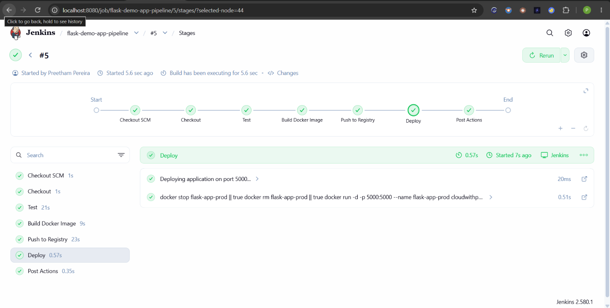
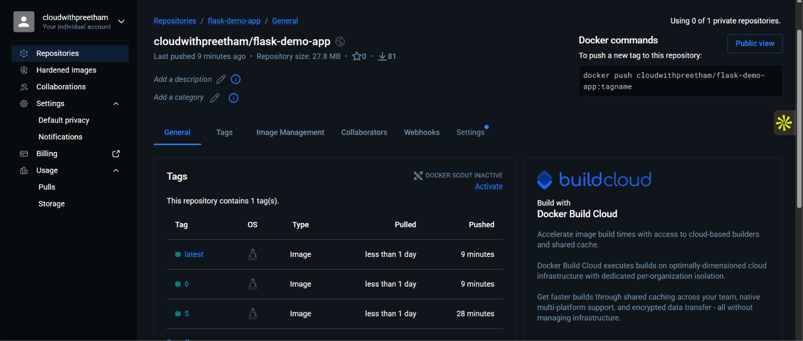
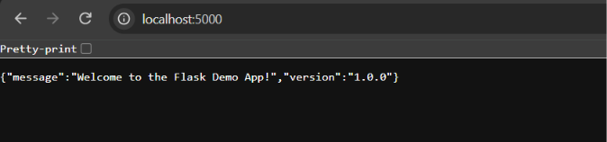

# Flask Demo App — CI/CD Pipeline with Jenkins & Docker

Automated Continuous Integration and Continuous Deployment (CI/CD) pipeline for a containerized Python Flask REST API built using Jenkins and Docker.

---

## 📌 Project Overview

This project implements an end-to-end DevOps automation pipeline for **Task 2 (DevOps Internship — Elevate Labs / MSME)**:

- **Application:** Lightweight Python Flask REST API featuring root (`/`), health check (`/health`), and payload echo (`/api/echo`) endpoints.
- **Testing:** Automated unit and regression test suite using `pytest`.
- **Containerization:** Production-ready container image using `python:3.11-alpine` with Gunicorn WSGI server.
- **CI/CD Pipeline:** Declarative Jenkins pipeline automating testing, Docker container packaging, registry distribution to Docker Hub, and local container deployment.

---

## 🏗️️ Architecture & Pipeline Flow

```text
[ Git Push to main ]
         │
         ▼
   ┌───────────┐
   │  Checkout │ ── Clones source repository from Git SCM (checkout scm)
   └─────┬─────┘
         │
         ▼
   ┌───────────┐
   │   Test    │ ── Runs pytest in isolated container via docker cp
   └─────┬─────┘
         │
         ▼
   ┌───────────┐
   │   Build   │ ── Builds Docker image tagged with :${BUILD_NUMBER} and :latest
   └─────┬─────┘
         │
         ▼
   ┌───────────┐
   │ Push (CD) │ ── Authenticates via Jenkins Credentials & pushes to Docker Hub
   └─────┬─────┘
         │
         ▼
   ┌───────────┐
   │   Deploy  │ ── Deploys container (flask-app-prod) locally on host port 5000
   └───────────┘
```

---

## 📁 Repository Structure

```text
flask-demo-app/
├── app.py                     # Flask application source code
├── test_app.py                # Automated pytest unit test suite
├── requirements.txt           # Python application dependencies
├── Dockerfile                 # Production Docker container recipe
├── .dockerignore              # Docker build context exclusions
├── .gitignore                 # Git version control exclusions
├── Jenkinsfile                # Declarative Jenkins CI/CD pipeline definition
├── screenshots/               # Task execution and verification proof
└── README.md                  # Project documentation & interview Q&A
```

---

## 🚀 API Endpoints

| Method | Endpoint    | Description        | Sample Request                                                                                              | Sample Response                                                  |
| :----- | :---------- | :----------------- | :---------------------------------------------------------------------------------------------------------- | :--------------------------------------------------------------- |
| `GET`  | `/`         | Root greeting      | `curl http://localhost:5000/`                                                                               | `{"message":"Welcome to the Flask Demo App!","version":"1.0.0"}` |
| `GET`  | `/health`   | Health-check probe | `curl http://localhost:5000/health`                                                                         | `{"status":"OK","timestamp":"2026-10-02T..."}`                   |
| `POST` | `/api/echo` | Payload reflection | `curl -X POST http://localhost:5000/api/echo -H "Content-Type: application/json" -d '{"message":"DevOps"}'` | `{"echo":"DevOps","receivedAt":"2026-10-02T..."}`                |

---

## 🛠️ Local Development & Testing

### 1. Run Locally with Virtual Environment

```bash
# Create and activate virtual environment
python3 -m venv .venv
source .venv/bin/activate

# Install dependencies
pip install -r requirements.txt

# Run automated tests
pytest -v

# Start local server
python3 app.py
```

### 2. Run Containerized Locally

```bash
# Build Docker image
docker build -t flask-demo-app:local .

# Run container on port 5000
docker run -d -p 5000:5000 --name test-flask-app flask-demo-app:local

# Check health endpoint
curl http://localhost:5000/health

# Stop and clean up container
docker stop test-flask-app && docker rm test-flask-app
```

---

## ⚙️ Jenkins Declarative Pipeline (`Jenkinsfile`)

The pipeline automates all verification, packaging, and delivery stages:

1. **Checkout:** Clones the tracked branch (`*/main`) from GitHub SCM using `checkout scm`.
2. **Test:** Spins up an isolated `python:3.11-alpine` container, transfers workspace files using `docker cp`, installs dependencies, and runs `pytest -v`.
3. **Build Docker Image:** Builds the application container tagged with both `:${BUILD_NUMBER}` and `:latest`.
4. **Push to Registry:** Authenticates using Jenkins Global Credentials (`dockerhub-credentials`) and pushes the multi-tag images to Docker Hub.
5. **Deploy:** Stops and removes any pre-existing `flask-app-prod` container, then spins up the updated container image bound to host port `5000`.
6. **Post Actions:** Cleans up dangling Docker images and temporary test containers.

---

## 📸 Pipeline & Deployment Proof

### 1. Jenkins Pipeline Execution



### 2. Docker Hub Published Images



### 3. Application Running Locally



---

## 📦 Docker Hub Repository

- **Image Repository:** `cloudwithpreetham/flask-demo-app`
- **Pull Command:**

```bash
docker pull cloudwithpreetham/flask-demo-app:latest
```

---

## 💡 DevOps Interview Q&A (Task 2)

### 1. What is Jenkins, and how is it used in CI/CD?

Jenkins is an open-source automation server written in Java that serves as the central orchestration engine for Continuous Integration and Continuous Delivery (CI/CD) pipelines. In a DevOps lifecycle, Jenkins automates the repetitive phases of software delivery:

- **Continuous Integration (CI):** Jenkins monitors source code management systems (like GitHub or GitLab) for new commits or pull requests, pulls down updated source code, resolves runtime dependencies, and triggers automated test suites and linters. This catches regression errors and integration issues early.
- **Continuous Delivery / Deployment (CD):** Once builds pass quality and security gates, Jenkins packages the application into deployable artifacts or container images (such as Docker images), pushes them to central registries (like Docker Hub, Amazon ECR, or Nexus), and triggers automated rollout procedures onto staging or production clusters.

### 2. What is a Jenkinsfile?

A `Jenkinsfile` is a text configuration file stored directly in the root of the project source code repository that defines the entire Jenkins pipeline using the **Pipeline-as-Code** paradigm. Storing pipeline definitions inside source control provides significant engineering benefits:

- **Version Control:** Pipeline configurations are versioned, tagged, and branched alongside the application source code.
- **Auditability and Code Review:** Changes to build, test, and deployment steps must undergo team review and pull request validation just like functional code.
- **Disaster Recovery:** If a Jenkins controller fails or needs migration, pipelines are immediately restored by pointing Jenkins to the repository containing the `Jenkinsfile`.

### 3. How do you create and configure Jenkins pipelines?

1. **Define the Pipeline as Code:** Write a `Jenkinsfile` at the root of the project repository using either Declarative or Scripted syntax to delineate stages (Checkout, Test, Build, Push, Deploy).
2. **Create the Job in Jenkins:** From the Jenkins dashboard, select **New Item**, supply a job name, and select **Pipeline** as the project type.
3. **Configure Source Control Management (SCM):** Under the job settings, navigate to the **Pipeline** configuration section, set **Definition** to **Pipeline script from SCM**, choose **Git**, and provide the repository URL and access credentials.
4. **Target Branch & Script Path:** Specify the target branch (e.g., `*/main`) and set the **Script Path** to `Jenkinsfile`.
5. **Configure Build Triggers:** Set up automation triggers such as **GitHub hook trigger for GITScm polling** (via GitHub Webhooks) or **Poll SCM** schedule to automatically trigger executions upon code pushes.

### 4. What are some common stages in a Jenkins pipeline?

- **Checkout / SCM:** Clones or updates the project code from version control (`git checkout`).
- **Dependency Resolution / Setup:** Installs required language runtimes, package managers, and dependencies (e.g., `pip install`, `npm ci`, `mvn dependency:resolve`).
- **Test / Quality Analysis:** Executes automated unit tests, integration tests, code coverage analysis, and style linters (e.g., `pytest`, `Jest`, `SonarQube`).
- **Security & Vulnerability Scan:** Scans source code and third-party dependencies for CVEs using SAST/DAST tools (e.g., Snyk, Trivy, OWASP Dependency-Check).
- **Build / Packaging:** Compiles binaries or packages container images (e.g., `docker build`).
- **Push / Artifact Publishing:** Pushes built artifacts or container images to secure registries (Docker Hub, AWS ECR, Artifactory).
- **Deploy:** Coordinates zero-downtime application updates across target environments (Docker host, Kubernetes, AWS ECS).
- **Post Actions / Notification:** Executes cleanup actions and sends delivery status alerts to Slack, Microsoft Teams, or email.

### 5. What is the difference between a declarative and scripted Jenkins pipeline?

| Feature                  | Declarative Pipeline                                                               | Scripted Pipeline                                                           |
| :----------------------- | :--------------------------------------------------------------------------------- | :-------------------------------------------------------------------------- |
| **Syntax & Structure**   | Strict, opinionated, predefined schema (`pipeline { agent any; stages { ... } }`). | Procedural, highly flexible Groovy DSL (`node { stage { ... } }`).          |
| **Learning Curve**       | Gentle and beginner-friendly; clear visual structure with minimal Groovy required. | Steeper; requires proficiency in Apache Groovy and Java syntax.             |
| **Error Handling**       | Built-in declarative directives (`post { success { ... } failure { ... } }`).      | Requires programmatic `try-catch-finally` constructs.                       |
| **Flow Control**         | Uses clean declarative conditions (`when { branch 'main' }`).                      | Uses traditional programming logic (`if/else`, `while`, custom methods).    |
| **Modern Best Practice** | Recommended standard for almost all modern CI/CD pipelines.                        | Primarily reserved for highly dynamic, legacy, or complex custom workflows. |
